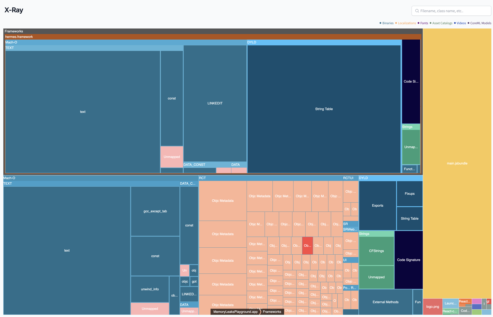

# Skill: 앱 번들 크기 분석

Ruler, App Store Connect, Emerge Tools를 사용하여 iOS 및 Android 앱의 다운로드/설치 크기를 측정합니다.

## 빠른 명령어

```bash
# Android (Ruler)
cd android && ./gradlew analyzeReleaseBundle

# iOS (Xcode export with thinning)
cd ios && xcodebuild -exportArchive \
  -archivePath MyApp.xcarchive \
  -exportPath ./export \
  -exportOptionsPlist ExportOptions.plist
# 확인: App Thinning Size Report.txt
```

## 사용 시기

- 앱 다운로드 크기가 너무 큼
- 사용자가 저장 공간 사용량에 대해 불만 제기
- 앱이 스토어 제한에 근접
- 릴리스 간 크기 회귀 비교

> **참고**: 이 스킬은 시각적 크기 리포트(Ruler, Emerge Tools X-Ray) 해석이 필요합니다. AI 에이전트는 아직 스크린샷을 자율적으로 처리할 수 없습니다. 리포트를 수동으로 검토하면서 이 가이드를 사용하거나, MCP 기반 시각적 피드백 통합을 기다려주세요(로드맵 참조).

## 주요 지표

| 지표 | 설명 | 사용자 영향 |
|------|------|------------|
| Download Size | 압축됨, 네트워크로 전송 | 다운로드 시간, 데이터 사용량 |
| Install Size | 압축 해제됨, 기기 저장소에 저장 | 저장 공간 |

**Google 연구 결과**: 6 MB 증가마다 설치 수가 1% 감소합니다.

## Android: Ruler (Spotify)

### 설정

`android/build.gradle`에 추가:

```groovy
buildscript {
    dependencies {
        classpath("com.spotify.ruler:ruler-gradle-plugin:2.0.0-beta-3")
    }
}
```

`android/app/build.gradle`에 추가:

```groovy
apply plugin: "com.spotify.ruler"

ruler {
    abi.set("arm64-v8a")  // 타겟 아키텍처
    locale.set("en")
    screenDensity.set(480)
    sdkVersion.set(34)
}
```

### 분석

```bash
cd android
./gradlew analyzeReleaseBundle
```

다음 항목이 포함된 HTML 리포트가 열립니다:
- Download size
- Install size
- 컴포넌트 분석(큰 것부터 작은 것 순)

### CI 크기 검증

```groovy
ruler {
    verification {
        downloadSizeThreshold = 20 * 1024 * 1024  // 20 MB
        installSizeThreshold = 50 * 1024 * 1024   // 50 MB
    }
}
```

임계값을 초과하면 빌드가 실패합니다.

## iOS: Xcode App Thinning

### App Store Connect 사용 (가장 정확함)

TestFlight에 업로드한 후:
1. App Store Connect 열기
2. 빌드로 이동
3. 기기 변형별 크기 테이블 보기

**참고**: TestFlight 빌드는 디버그 데이터를 포함하며, App Store 빌드는 DRM으로 인해 약간 더 큽니다.

### Xcode Export 사용

1. 앱 아카이브: **Product → Archive**
2. Organizer에서 **Distribute App** 클릭
3. **Custom** 선택
4. **App Thinning: All compatible device variants** 선택

또는 `ExportOptions.plist`에서:

```xml
<key>thinning</key>
<string>&lt;thin-for-all-variants&gt;</string>
```

### 출력

다음 항목이 포함된 폴더 생성:
- **Universal IPA**: 모든 변형 결합
- **Thinned IPAs**: 기기 변형별 하나씩
- **App Thinning Size Report.txt**:

```
Variant: SampleApp-<UUID>.ipa
App + On Demand Resources size: 3.5 MB compressed, 10.6 MB uncompressed
App size: 3.5 MB compressed, 10.6 MB uncompressed
```

- Compressed = Download size
- Uncompressed = Install size

## Emerge Tools (크로스 플랫폼)

시각적 분석을 제공하는 타사 서비스입니다.

### 업로드

웹 인터페이스 또는 CI 통합을 통해 IPA, APK 또는 AAB를 업로드합니다.

### 기능



- **X-Ray**: 트리맵 시각화(바이너리용 source-map-explorer와 유사)
  - Frameworks(hermes.framework), Mach-O 섹션(TEXT, DATA) 등 표시
  - 색상 코딩: Binaries, Localizations, Fonts, Asset Catalogs, Videos, CoreML Models
  - 보이는 컴포넌트: `main.jsbundle`(JS 코드), RCT 모듈, DYLD 섹션
- **Breakdown**: 컴포넌트별 크기
- **Insights**: 자동화된 제안(주의해서 사용)

**주의**: 일부 제안은 React Native에 적용되지 않을 수 있습니다(예: "remove Hermes").

## 크기 비교

| 도구 | 플랫폼 | 정확도 | CI 통합 |
|------|--------|--------|---------|
| Ruler | Android | 높음 | 예 (Gradle) |
| App Store Connect | iOS | 최고 | 아니오 |
| Xcode Export | iOS | 높음 | 예 (xcodebuild) |
| Emerge Tools | 둘 다 | 높음 | 예 (API) |

## 일반적인 React Native 앱 크기

| 컴포넌트 | 대략적인 크기 |
|----------|--------------|
| Hermes 엔진 | ~2-3 MB |
| React Native 코어 | ~3-5 MB |
| JavaScript 번들 | 1-10 MB |
| 에셋(이미지 등) | 다양함 |

**베이스라인 빈 앱**: 다운로드 약 6-10 MB

## 최적화 영향 예시

| 최적화 | 크기 감소 |
|---------|----------|
| R8 활성화 (Android) | ~30% |
| 미사용 polyfill 제거 | 400+ KB |
| Asset catalog (iOS) | 에셋의 10-50% |
| Tree shaking | 10-15% |

## 빠른 명령어

```bash
# Android 릴리스 번들 크기
cd android && ./gradlew bundleRelease
# 확인: android/app/build/outputs/bundle/release/

# iOS 아카이브
cd ios && xcodebuild -workspace ios/MyApp.xcworkspace \
  -scheme MyApp \
  -configuration Release \
  -archivePath MyApp.xcarchive \
  archive

# Thinning 리포트로 export
cd ios && xcodebuild -exportArchive \
  -archivePath MyApp.xcarchive \
  -exportPath ./export \
  -exportOptionsPlist ExportOptions.plist
```

## 관련 스킬

- [bundle-r8-android.md](./bundle-r8-android.md) - Android 크기 감소
- [bundle-native-assets.md](./bundle-native-assets.md) - 에셋 전달 최적화
- [bundle-analyze-js.md](./bundle-analyze-js.md) - JS 번들 분석
