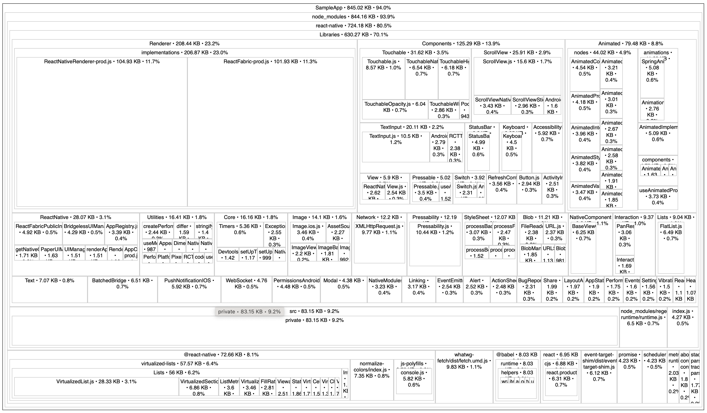
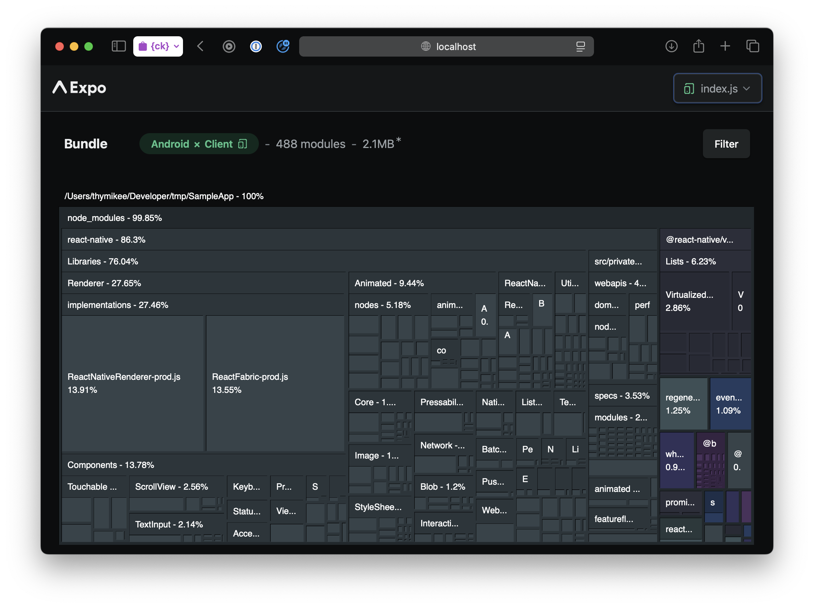

# Skill: JS 번들 크기 분석

source-map-explorer와 Expo Atlas를 사용하여 JavaScript 번들의 구성을 시각화합니다.

## 빠른 명령어

```bash
# React Native CLI
npx react-native bundle \
  --entry-file index.js \
  --bundle-output output.js \
  --platform ios \
  --sourcemap-output output.js.map \
  --dev false --minify true && \
npx source-map-explorer output.js --no-border-checks

# Expo
EXPO_UNSTABLE_ATLAS=true npx expo export --platform ios && npx expo-atlas
```

## 언제 사용하나요

- JS 번들이 너무 크게 느껴질 때
- 무거운 의존성을 식별하고 싶을 때
- 시작 시간 문제를 조사할 때
- 최적화 전후 비교를 할 때

> **참고**: 이 스킬은 시각적 treemap 출력(source-map-explorer, Expo Atlas)을 해석하는 것을 포함합니다. AI 에이전트는 아직 스크린샷을 자동으로 처리할 수 없습니다. 시각화를 수동으로 검토하면서 이 가이드를 사용하거나 MCP 기반 시각적 피드백 통합을 기다리세요(로드맵 참조).

## Hermes Bytecode 이해하기

최신 React Native (0.70+)는 raw JavaScript가 아닌 Hermes bytecode를 사용합니다:
- 런타임에 파싱을 건너뜁니다
- 여전히 작은 번들의 이점을 받습니다
- 무거운 임포트는 여전히 시작 시 실행됩니다

**번들 크기의 영향:**
- 더 큰 bytecode = 스토어에서 더 긴 다운로드
- 초기화 경로의 더 많은 임포트 = 더 느린 TTI

## 방법 1: source-map-explorer

### Source Map과 함께 번들 생성

**React Native CLI:**

```bash
npx react-native bundle \
  --entry-file index.js \
  --bundle-output output.js \
  --platform ios \
  --sourcemap-output output.js.map \
  --dev false \
  --minify true
```

**Expo (SDK 51+):**

```bash
npx expo export --platform ios --source-maps --output-dir dist
# 번들 위치: dist/ios/_expo/static/js/ios/*.js
# Source map 위치: dist/ios/_expo/static/js/ios/*.map
```

### 분석

```bash
npx source-map-explorer output.js --no-border-checks
```

**참고**: Metro의 비표준 source map으로 인해 `--no-border-checks`가 필요합니다.

treemap 시각화와 함께 브라우저가 열립니다:



treemap이 보여주는 것:
- **계층 구조**: `node_modules/` → `react-native/` → `Libraries/` → 개별 파일
- **크기**: 상자 영역이 파일 크기에 비례 (레이블에 KB 표시)
- **주요 컴포넌트 표시**:
  - `react-native` (724.18 KB, 80.5%)
  - `Renderer` (208.44 KB) - ReactNativeRenderer-prod.js, ReactFabric-prod.js
  - `Components` (125.29 KB) - Touchable, ScrollView 등
  - `Animated` (79.48 KB) - 애니메이션 시스템
  - `virtualized-lists` (57.57 KB) - FlatList 내부

섹션을 클릭하면 해당 디렉토리로 드릴다운됩니다.

**제한사항**: 매핑 문제로 인해 ~30% 정보를 잃을 수 있습니다.

## 방법 2: Expo Atlas

Expo 프로젝트에서 더 정확합니다 (또는 bare RN을 위한 우회 방법 사용).

### Expo 프로젝트의 경우

```bash
# Atlas가 활성화된 상태로 시작
EXPO_UNSTABLE_ATLAS=true npx expo start --no-dev

# 또는 export
EXPO_UNSTABLE_ATLAS=true npx expo export
```

그런 다음 UI 실행:

```bash
npx expo-atlas
```



Expo Atlas는 모듈 크기와 의존성을 보여주는 유사한 treemap 인터페이스로 Expo 프로젝트에 대한 더 정확한 시각화를 제공합니다.

### Expo가 아닌 프로젝트의 경우

`expo-atlas-without-expo` 패키지를 사용하세요.

## 방법 3: Re.Pack 번들 분석 (Webpack/Rspack)

Re.Pack을 사용하는 경우:

### webpack-bundle-analyzer

```bash
rspack build --analyze
```

### bundle-stats / statoscope

```bash
# stats 생성
npx react-native bundle \
  --platform android \
  --entry-file index.js \
  --dev false \
  --minify true \
  --json stats.json

# 분석
npx bundle-stats --html --json stats.json
```

### Rsdoctor

```javascript
// rspack.config.js
const { RsdoctorRspackPlugin } = require('@rsdoctor/rspack-plugin');

module.exports = {
  plugins: [
    process.env.RSDOCTOR && new RsdoctorRspackPlugin(),
  ].filter(Boolean),
};
```

실행:

```bash
RSDOCTOR=true npx react-native start
```

## 무엇을 찾아야 하나요

### 주의 신호

| 발견사항 | 문제점 | 해결책 |
|---------|---------|----------|
| 전체 라이브러리 임포트됨 | Barrel export | 직접 import 사용 |
| 중복 패키지 | 여러 버전 | package.json에서 중복 제거 |
| 번들에 dev 의존성 포함 | 잘못된 import | 조건부 import 확인 |
| 큰 polyfill들 | Hermes에 불필요 | 제거 (native-sdks-over-polyfills.md 참조) |
| locale이 포함된 Moment.js | 비대한 날짜 라이브러리 | date-fns 또는 dayjs로 전환 |

### 일반적인 문제 항목

- **Lodash 전체 import**: `lodash-es` 또는 특정 import 사용
- **Moment.js**: `date-fns` 또는 `dayjs`로 교체
- **Intl polyfill들**: Hermes 지원 확인
- **AWS SDK**: 특정 서비스만 import

## 코드 예제

### Barrel Import 영향 식별

```tsx
// 나쁨: barrel을 통해 전체 라이브러리를 import
import { format } from 'date-fns';

// 번들에: date-fns 전체가 로드됨

// 좋음: 직접 import
import format from 'date-fns/format';

// 번들에: format 함수만 포함
```

## 번들 비교

### source-map-explorer

```bash
# baseline 생성
npx react-native bundle ... --bundle-output baseline.js --sourcemap-output baseline.js.map

# 변경 후 새 번들 생성
npx react-native bundle ... --bundle-output current.js --sourcemap-output current.js.map

# 브라우저에서 수동으로 비교
```

### Re.Pack (자동화)

```bash
npx bundle-stats compare baseline-stats.json current-stats.json
```

## 빠른 명령어

**React Native CLI:**

```bash
# iOS 번들 분석
npx react-native bundle \
  --entry-file index.js \
  --bundle-output ios-bundle.js \
  --platform ios \
  --sourcemap-output ios-bundle.js.map \
  --dev false \
  --minify true && \
npx source-map-explorer ios-bundle.js --no-border-checks

# Android 번들 분석
npx react-native bundle \
  --entry-file index.js \
  --bundle-output android-bundle.js \
  --platform android \
  --sourcemap-output android-bundle.js.map \
  --dev false \
  --minify true && \
npx source-map-explorer android-bundle.js --no-border-checks
```

**Expo:**

```bash
# Expo Atlas 사용 (Expo 프로젝트에 권장)
EXPO_UNSTABLE_ATLAS=true npx expo export --platform ios
npx expo-atlas
```

## 관련 스킬

- [bundle-barrel-exports.md](./bundle-barrel-exports.md) - Barrel import 문제 해결
- [bundle-tree-shaking.md](./bundle-tree-shaking.md) - Dead code elimination 활성화
- [bundle-library-size.md](./bundle-library-size.md) - 라이브러리 추가 전 크기 확인
