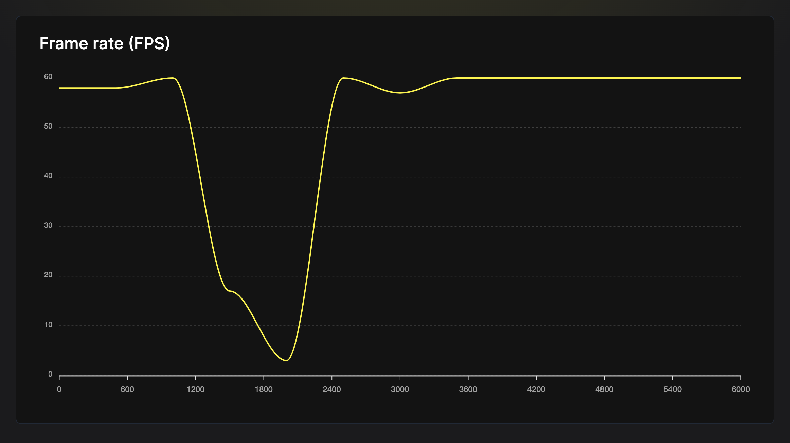

# Skill: 고급 리스트 렌더링

대용량 리스트를 성능 좋게 렌더링하기 위해 ScrollView를 FlatList 또는 FlashList로 교체합니다.

## 기본 패턴

**잘못된 방법:**

```jsx
<ScrollView>
  {items.map((item) => <Item key={item.id} {...item} />)}
</ScrollView>
```

**올바른 방법:**

```jsx
<FlashList
  data={items}
  keyExtractor={(item) => item.id}
  renderItem={({ item }) => <Item {...item} />}
  estimatedItemSize={50}
/>
```

## 사용 시점

- 10~20개 이상의 아이템을 리스트로 렌더링할 때
- 리스트 스크롤이 버벅거리거나 느릴 때
- 리스트 데이터 로딩 시 앱이 멈출 때
- 긴 리스트에서 메모리 사용량이 급증할 때

## 사전 요구사항

- FlashList 사용을 위한 `@shopify/flash-list` (권장)
- 리스트 가상화(virtualization) 개념 이해

## 단계별 가이드

### 1. 문제 파악



FPS 그래프는 리스트 렌더링 중 심각한 성능 문제를 보여줍니다:
- FPS가 ~60에서 시작 (부드러움)
- 무거운 리스트 작업 중 ~3 FPS로 하락
- 렌더링 완료 후 회복

```jsx
// 나쁨: ScrollView는 모든 아이템을 한 번에 렌더링
const BadList = ({ items }) => (
  <ScrollView>
    {items.map((item, index) => (
      <View key={index}>
        <Text>{item}</Text>
      </View>
    ))}
  </ScrollView>
);
```

5000개 아이템의 경우, 즉시 5000개 뷰를 생성하여 다음 문제 발생:
- 수 초간 멈춤
- FPS가 0으로 하락
- 높은 메모리 사용량

### 2. FlatList로 교체

```jsx
import { FlatList } from 'react-native';

const BetterList = ({ items }) => {
  const renderItem = ({ item }) => (
    <View>
      <Text>{item}</Text>
    </View>
  );

  return (
    <FlatList
      data={items}
      renderItem={renderItem}
      keyExtractor={(item, index) => index.toString()}
    />
  );
};
```

FlatList는 보이는 아이템 + 버퍼만 렌더링합니다 (윈도잉).

### 3. getItemLayout으로 FlatList 최적화

고정 높이 아이템의 경우, 레이아웃 측정을 건너뜁니다:

```jsx
const ITEM_HEIGHT = 50;

const OptimizedList = ({ items }) => {
  const renderItem = ({ item }) => (
    <View style={{ height: ITEM_HEIGHT }}>
      <Text>{item}</Text>
    </View>
  );

  const getItemLayout = (_, index) => ({
    length: ITEM_HEIGHT,
    offset: ITEM_HEIGHT * index,
    index,
  });

  return (
    <FlatList
      data={items}
      renderItem={renderItem}
      keyExtractor={(item, index) => index.toString()}
      getItemLayout={getItemLayout}
    />
  );
};
```

### 4. FlashList로 업그레이드 (최고 성능)

```bash
npm install @shopify/flash-list
```

```jsx
import { FlashList } from '@shopify/flash-list';

const BestList = ({ items }) => {
  const renderItem = ({ item }) => (
    <View style={{ height: 50 }}>
      <Text>{item}</Text>
    </View>
  );

  return (
    <FlashList
      data={items}
      renderItem={renderItem}
      estimatedItemSize={50}  // FlashList에 필수
    />
  );
};
```

**FlashList 장점:**
- 새로운 뷰를 생성하는 대신 뷰를 재활용
- 벤치마크에서 78/100 vs 25/100 성능 점수
- ~54 FPS로 더 부드러운 스크롤 (FlatList보다 높음)

## 코드 예제

### 가변 높이 아이템

```jsx
// estimatedItemSize 평균 계산
// 아이템 높이: 50px, 100px, 150px
// 평균: (50 + 100 + 150) / 3 = 100px

<FlashList
  data={items}
  renderItem={renderItem}
  estimatedItemSize={100}
/>
```

### 혼합 아이템 타입

```jsx
<FlashList
  data={items}
  renderItem={({ item }) => {
    if (item.type === 'header') return <Header {...item} />;
    if (item.type === 'product') return <Product {...item} />;
    return <DefaultItem {...item} />;
  }}
  getItemType={(item) => item.type}  // 재활용 개선
  estimatedItemSize={80}
/>
```

### FlatList 최적화 (FlashList 미사용 시)

```jsx
<FlatList
  data={items}
  renderItem={renderItem}
  // 성능 props
  removeClippedSubviews={true}
  maxToRenderPerBatch={10}
  updateCellsBatchingPeriod={50}
  initialNumToRender={10}
  windowSize={5}
  // 리렌더 방지
  keyExtractor={(item) => item.id}
  extraData={selectedId}  // 선택 변경 시에만
/>
```

## 성능 비교

| 컴포넌트 | 5000 아이템 로딩 | 스크롤 FPS | 메모리 |
|-----------|-----------------|------------|--------|
| ScrollView | 1-3초 멈춤 | < 30 | 높음 |
| FlatList | ~100ms | ~45 | 중간 |
| FlashList | ~50ms | ~54 | 낮음 |

## 의사결정 매트릭스

| 시나리오 | 권장사항 |
|----------|---------------|
| 20개 미만 정적 아이템 | ScrollView 사용 가능 |
| 20-100개 아이템 | 최소 FlatList |
| 100개 이상 아이템 | FlashList |
| 복잡한 아이템 레이아웃 | `getItemType`과 함께 FlashList |
| 고정 높이 아이템 | `getItemLayout` 또는 `estimatedItemSize` 추가 |

## 흔한 실수

- **인라인 renderItem 함수**: 리렌더를 유발합니다. 외부에서 정의하거나 `useCallback` 사용.
- **keyExtractor 누락**: 가능하면 배열 인덱스가 아닌 고유 ID 사용.
- **estimatedItemSize 경고 무시**: FlashList는 미설정 시 경고. 항상 제공하세요.
- **무거운 아이템 컴포넌트**: 리스트 아이템을 가볍게 유지. 부수 효과는 외부로 이동.

## 관련 스킬

- [js-profile-react.md](./js-profile-react.md) - 리스트 렌더링 프로파일링
- [js-measure-fps.md](./js-measure-fps.md) - 스크롤 성능 측정
