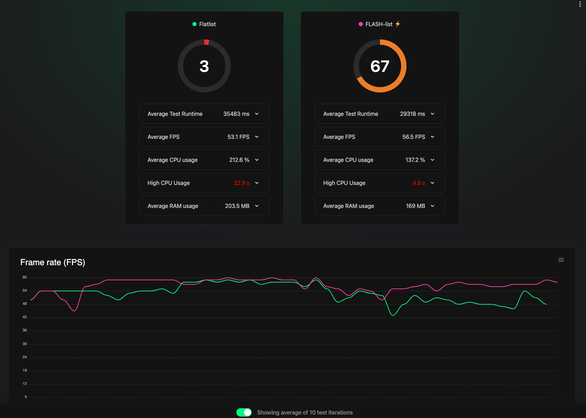

# Skill: JS FPS 측정

JavaScript 프레임 레이트를 모니터링하고 측정하여 앱 부드러움을 정량화하고 성능 회귀를 식별합니다.

## 빠른 명령어

```bash
# 방법 1: 내장 성능 모니터
# 기기 흔들기 → Dev Menu → "Perf Monitor"

# 방법 2: Flashlight (Android, 상세 리포트)
curl https://get.flashlight.dev | bash
flashlight measure
```

## 사용 시점

- 애니메이션이 끊기거나 버벅거릴 때
- 스크롤이 부드럽지 않을 때
- 최적화 전후 기준 FPS 메트릭이 필요할 때
- 빌드 간 성능 비교가 필요할 때

## 사전 요구사항

- 기기/시뮬레이터에서 실행 중인 React Native 앱
- Flashlight 사용 시: Android 기기 (iOS 미지원)

> **참고**: 이 스킬은 시각적 출력(FPS 그래프, 성능 오버레이) 해석이 필요합니다. AI 에이전트는 아직 스크린샷을 자율적으로 처리할 수 없습니다. 메트릭을 수동으로 검토하는 동안 가이드로 사용하거나 MCP 기반 시각적 피드백 통합을 기다리세요(로드맵 참조).

## 단계별 가이드

### 방법 1: React Perf Monitor (빠른 확인)

1. Dev Menu 열기:
   - iOS Simulator: `Ctrl + Cmd + Z` 또는 Device > Shake
   - Android Emulator: `Cmd + M` (Mac) / `Ctrl + M` (Windows)

2. **"Perf Monitor"** 선택

3. 오버레이에서 표시되는 항목 관찰:
   - **UI (Main) thread FPS** - 네이티브 렌더링
   - **JS thread FPS** - JavaScript 실행
   - **RAM 사용량**

4. Dev Menu에서 "Hide Perf Monitor"로 숨기기

**해석:**
- **60 FPS** = 부드러움 (프레임당 16.6ms)
- **< 60 FPS** = 프레임 드롭
- **120 FPS** 고주사율 기기 목표 (프레임당 8.3ms)

### 방법 2: Flashlight (자동화된 벤치마킹)

> Android 전용. 상세한 리포트와 JSON 내보내기 제공.



Flashlight는 비교 성능 데이터를 보여줍니다:
- **점수** (0-100): 전체 성능 등급 (높을수록 좋음)
- **평균 FPS**: 부드러운 스크롤을 위한 60 FPS 목표
- **FPS 그래프**: 테스트 기간 동안 실시간 프레임 레이트
- **CPU/RAM 메트릭**: 리소스 소비

이미지는 FlatList (점수: 3) vs FlashList (점수: 67) - 점수와 FPS 그래프 모두에서 극적인 차이를 보여줍니다.

**설치:**

```bash
# Flashlight CLI 설치
curl https://get.flashlight.dev | bash
```

**사용법:**

```bash
# 측정 시작 (Android에서 앱 실행 중이어야 함)
flashlight measure
```

**기능:**
- 실시간 FPS 그래프
- 평균 FPS 계산
- CPU 및 RAM 메트릭
- 전체 성능 점수
- CI 비교를 위한 JSON 내보내기

### 중요: 개발 모드 비활성화

**정확한 측정을 위해 항상 개발 모드를 비활성화하세요:**

**Android:**
1. Dev Menu 열기
2. Settings > JS Dev Mode → **OFF**

**iOS (React Native CLI):**
```bash
# 프로덕션 모드로 Metro 실행
npx react-native start --reset-cache
# 그 다음 릴리스 variant 빌드
```

**Expo:**
```bash
# 개발 모드 없이 Metro 시작
npx expo start --no-dev --minify
# 정확한 측정을 위해 릴리스 테스트는 EAS Build 사용
```

## 코드 예제

### FPS 드롭 원인 식별

**UI FPS는 떨어지는데 JS FPS는 정상:**
- 네이티브 렌더링 문제
- 너무 많은 뷰/복잡한 레이아웃
- 무거운 네이티브 애니메이션

**JS FPS는 떨어지는데 UI FPS는 정상:**
- JavaScript 계산이 블로킹
- 비용이 많이 드는 React 리렌더
- `longRunningFunction` 패턴 찾기

**둘 다 떨어짐:**
- 혼합 문제, JS 프로파일링부터 시작

### 목표 프레임 예산

```javascript
// 60 FPS = 프레임당 16.6ms
const FRAME_BUDGET_60 = 16.6;

// 120 FPS = 프레임당 8.3ms
const FRAME_BUDGET_120 = 8.3;

// 함수가 더 오래 걸리면 프레임이 드롭됩니다
const longRunningFunction = () => {
  let i = 0;
  while (i < 1000000000) { // 수 초간 블로킹!
    i++;
  }
};
```

## 결과 해석

| FPS 범위 | 사용자 인식 | 조치 |
|-----------|-----------------|--------|
| 55-60 | 부드러움 | 허용 가능 |
| 45-55 | 약간 끊김 | 조사 필요 |
| 30-45 | 눈에 띄는 jank | 최적화 필요 |
| < 30 | 매우 끊김 | 중요 수정 필요 |

## Flashlight CI 통합

```bash
# 측정 결과를 JSON으로 내보내기
flashlight measure --output results.json

# 빌드 비교
flashlight compare baseline.json current.json
```

## 흔한 실수

- **개발 모드에서 측정**: 결과가 인위적으로 느려짐
- **실제 기기 미사용**: 시뮬레이터는 실제 성능을 반영하지 않음
- **UI 스레드 무시**: React Native는 두 개의 스레드를 가짐 - JS 문제가 항상 UI 스레드에 나타나지 않음
- **단일 측정**: 여러 번 실행, FPS는 변동됨

## 관련 스킬

- [js-profile-react.md](./js-profile-react.md) - FPS 드롭 원인 찾기
- [js-animations-reanimated.md](./js-animations-reanimated.md) - 애니메이션 관련 드롭 수정
- [js-lists-flatlist-flashlist.md](./js-lists-flatlist-flashlist.md) - 스크롤 관련 드롭 수정
