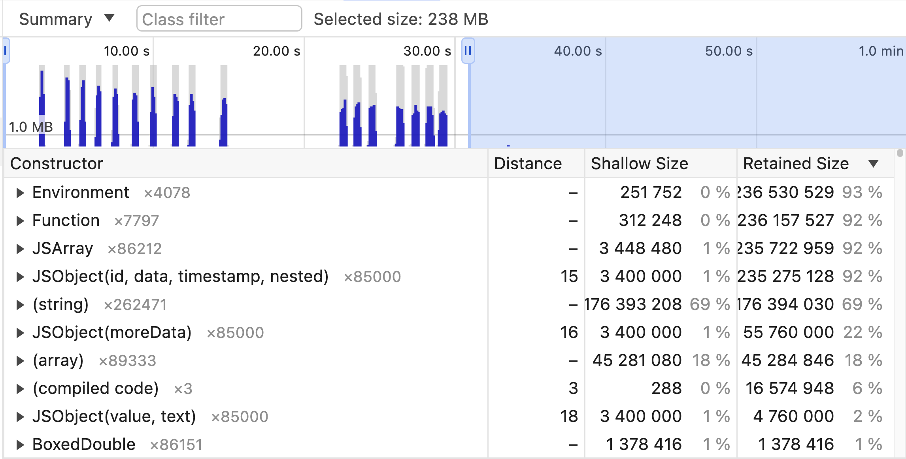

# Skill: JS 메모리 누수 추적

React Native DevTools 메모리 프로파일링을 사용하여 JavaScript 메모리 누수를 찾고 수정합니다.

## 기본 패턴

**잘못된 방법 (리스너가 정리되지 않음):**

```jsx
useEffect(() => {
  const sub = EventEmitter.addListener('event', handler);
  // 정리 누락!
}, []);
```

**올바른 방법 (적절한 정리):**

```jsx
useEffect(() => {
  const sub = EventEmitter.addListener('event', handler);
  return () => sub.remove();
}, []);
```

## 사용 시점

- 앱 메모리 사용량이 시간이 지남에 따라 증가할 때
- 장시간 사용 후 앱이 크래시될 때
- 화면 간 네비게이션이 메모리를 증가시킬 때
- 이벤트 리스너나 타이머가 정리되지 않았다고 의심될 때

## 사전 요구사항

- React Native DevTools 접근 가능
- 개발 모드에서 실행 중인 앱

## 단계별 가이드

### 1. 메모리 프로파일러 열기

1. React Native DevTools 실행 (Metro에서 `j` 누르기)
2. **Memory** 탭으로 이동
3. **"Allocation instrumentation on timeline"** 선택

### 2. 메모리 할당 기록

1. 하단의 **"Start"** 클릭
2. 누수가 발생할 수 있는 작업 수행 (네비게이션, 이벤트 트리거 등)
3. 10-30초 대기
4. **"Stop"** 클릭

### 3. 타임라인 분석

**주요 지표:**
- **파란색 막대** = 할당된 메모리
- **회색 막대** = 해제된 메모리 (가비지 수집됨)
- **파란색으로 유지되는 막대** = 잠재적 누수!

### 4. 누수 객체 조사



Memory 탭 표시:
- **Timeline** (상단): 파란색 막대 = 할당, 시간 범위 선택하여 필터링
- **Summary view** (하단): 할당 수와 함께 생성자 목록

**주요 열:**
- **Constructor**: 객체 타입 (예: `JSObject`, `Function`, `(string)`)
- **Count**: 인스턴스 수 (×85000 = 85,000개 객체)
- **Shallow Size**: 객체 자체의 메모리
- **Retained Size**: 객체가 삭제되면 해제될 메모리 (참조 포함)

**경고 신호**: 작은 Shallow size %에 큰 Retained size % = 클로저나 참조가 큰 객체를 보유.

**조사 방법:**
1. 타임라인에서 파란색 스파이크 클릭
2. 아래 Constructor 목록 확인
3. **Shallow size** vs **Retained size** 확인
4. 생성자를 확장하여 개별 할당 확인
5. 클릭하여 정확한 소스 위치 확인

### 5. 수정 확인

수정 후 다시 프로파일링. 최근 것을 제외한 모든 막대가 회색으로 변해야 함.

## 코드 예제

### 일반적인 누수 패턴

**1. 정리되지 않은 리스너:**

```jsx
// 나쁨: 메모리 누수
const BadEventComponent = () => {
  useEffect(() => {
    const subscription = EventEmitter.addListener('myEvent', handleEvent);
    // 정리 누락!
  }, []);

  return <Text>Listening...</Text>;
};

// 좋음: 적절한 정리
const GoodEventComponent = () => {
  useEffect(() => {
    const subscription = EventEmitter.addListener('myEvent', handleEvent);
    return () => subscription.remove(); // 정리!
  }, []);

  return <Text>Listening...</Text>;
};
```

**2. 정리되지 않은 타이머:**

```jsx
// 나쁨: 메모리 누수
const BadTimerComponent = () => {
  useEffect(() => {
    const timer = setInterval(() => {
      setCount(prev => prev + 1);
    }, 1000);
    // 정리 누락!
  }, []);
};

// 좋음: 적절한 정리
const GoodTimerComponent = () => {
  useEffect(() => {
    const timer = setInterval(() => {
      setCount(prev => prev + 1);
    }, 1000);
    return () => clearInterval(timer); // 정리!
  }, []);
};
```

**3. 큰 객체를 캡처하는 클로저:**

```jsx
// 나쁨: 클로저가 전체 배열 캡처
class BadClosureExample {
  private largeData = new Array(1000000).fill('data');

  createLeakyFunction() {
    return () => this.largeData.length; // this.largeData 캡처
  }
}

// 좋음: 필요한 것만 캡처
class GoodClosureExample {
  private largeData = new Array(1000000).fill('data');

  createEfficientFunction() {
    const length = this.largeData.length; // 값 추출
    return () => length; // 원시값만 캡처
  }
}
```

**4. 증가하는 전역 배열:**

```jsx
// 나쁨: 전역 배열이 절대 정리되지 않음
let leakyClosures = [];

const createLeak = () => {
  const data = generateLargeData();
  leakyClosures.push(() => data); // 계속 증가!
};

// 좋음: 완료 시 정리하거나 WeakRef 사용
const createNoLeak = () => {
  const data = generateLargeData();
  const closure = () => data;
  // 사용 후 가비지 수집되도록 함
  return closure;
};
```

## 메모리 프로파일러 메트릭

| 메트릭 | 의미 |
|--------|---------|
| **Shallow size** | 객체 자체가 보유한 메모리 |
| **Retained size** | 객체가 삭제되면 해제될 메모리 (참조 포함) |

**작은 shallow size에 큰 retained size** = 객체가 다른 큰 객체에 대한 참조를 보유 (클로저에서 흔함).

## 흔한 실수

- **GC 강제 안 함**: GC는 주기적으로 실행됨. 누수라고 결론 내리기 전에 다른 것을 할당하여 수집을 트리거.
- **회색 막대 무시**: 회색 = 적절히 수집됨. 지속되는 파란색 막대만 누수.
- **useEffect 정리 누락**: 가장 흔한 React Native 누수 원인.

## 관련 스킬

- [native-memory-leaks.md](./native-memory-leaks.md) - 네이티브 측 메모리 누수
- [js-profile-react.md](./js-profile-react.md) - 일반 프로파일링
