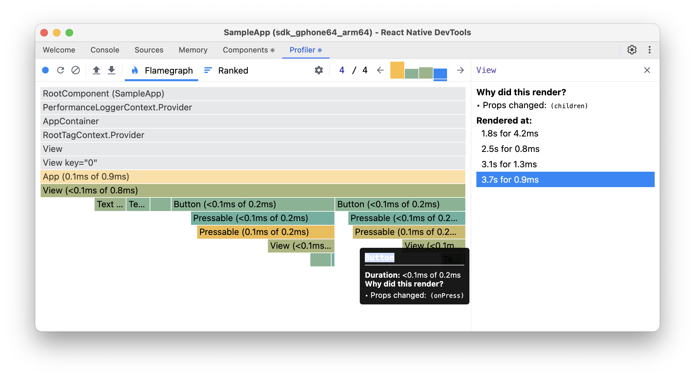

# Skill: React 성능 프로파일링

React Native DevTools를 사용하여 불필요한 리렌더링과 성능 병목 지점을 식별합니다.

## 빠른 명령어

```bash
# React Native DevTools 열기 (Metro 터미널에서 'j' 누르기)
# 또는 기기를 흔들기 → "Open DevTools"
# Profiler 탭으로 이동 → Start profiling → 액션 수행 → Stop
```

## 언제 사용하나요

- 상호작용 중 앱이 느리거나 버벅거리는 느낌
- 불필요하게 리렌더링되는 컴포넌트 식별 필요
- 느린 리스트 스크롤링이나 폼 입력 조사
- 메모이제이션이나 상태 관리 변경을 적용하기 전

## 사전 준비사항

- React Native DevTools 접근 가능 (Metro에서 `j` 누르기 또는 Dev Menu 사용)
- 개발 모드에서 앱 실행 중
- React Compiler 지원을 위한 React DevTools 버전 6.0.1+

> **참고**: 이 스킬은 시각적 프로파일러 출력(flame graph, 컴포넌트 하이라이팅) 해석이 필요합니다. AI 에이전트는 아직 스크린샷을 자동으로 처리할 수 없습니다. 프로파일러 UI를 직접 검토하면서 이 가이드를 참고하거나, MCP 기반 시각적 피드백 통합을 기다려주세요(로드맵 참고).

## 단계별 가이드

### 1. React Native DevTools 열기

```bash
# 옵션 A: Metro 터미널에서 'j' 누르기 (RN CLI와 Expo 모두 작동)
# 옵션 B: 기기 흔들기 / Cmd+D (iOS) / Cmd+M (Android) → "Open DevTools"
# Expo: 브라우저의 Expo DevTools에서도 접근 가능
```

### 2. 프로파일러 설정 구성

1. **Profiler** 탭으로 이동
2. 톱니바퀴 아이콘(⚙️) 클릭하여 설정 열기
3. 다음 항목 활성화:
   - "Highlight updates when components render"
   - "Record why each component rendered while profiling"

### 3. 프로파일링 세션 기록

```
1. "Start profiling" (파란 원) 또는 "Reload and start profiling" 클릭
2. 분석하려는 상호작용 수행
3. "Stop profiling" 클릭
```

**시작 성능 분석**에는 "Reload and start profiling"을 사용하세요.

### 4. Flame Graph 분석



Flame graph는 타이밍과 함께 컴포넌트 렌더 계층구조를 보여줍니다:

**색상 표시:**
- **노란색 컴포넌트**: 렌더링에 가장 많은 시간 소요 (여기에 집중)
- **녹색 컴포넌트**: 빠름/메모이제이션됨
- **회색 컴포넌트**: 렌더링되지 않음

**오른쪽 패널은 "Why did this render?" 표시:**
- Props 변경됨 (어떤 prop인지 표시, 예: `children`, `onPress`)
- 타임스탬프와 기간으로 렌더링됨 (예: "3.7s for 0.9ms")

**컴포넌트 클릭 시 표시:**
- 렌더링된 이유 (훅 변경, props 변경, 부모 리렌더링)
- 렌더 기간
- 영향받은 자식 컴포넌트

### 5. 상향식 분석을 위한 Ranked View 사용

"Ranked" 탭을 클릭하면 렌더 시간 기준으로 정렬된 컴포넌트를 볼 수 있습니다(느린 것부터).

### 6. JavaScript CPU 프로파일링

React 외 성능 문제의 경우:

1. **JavaScript Profiler** 탭으로 이동 (설정에서 숨겨져 있으면 활성화)
2. "Start" 클릭하여 기록
3. 액션 수행
4. "Stop" 클릭
5. **Heavy (Bottom Up)** 뷰를 사용하여 가장 느린 함수 찾기

## 코드 예제

### Before: 불필요한 리렌더링

```jsx
const App = () => {
  const [count, setCount] = useState(0);

  return (
    <View>
      <Text>{count}</Text>
      {/* Button이 count 변경마다 리렌더링됨 */}
      <Button onPress={() => setCount(count + 1)} title="Press" />
    </View>
  );
};

const Button = ({onPress, title}) => (
  <Pressable onPress={onPress}>
    <Text>{title}</Text>
  </Pressable>
);
```

### After: 메모이제이션됨

```jsx
const App = () => {
  const [count, setCount] = useState(0);
  const onPressHandler = useCallback(() => setCount(c => c + 1), []);

  return (
    <View>
      <Text>{count}</Text>
      <Button onPress={onPressHandler} title="Press" />
    </View>
  );
};

const Button = memo(({onPress, title}) => (
  <Pressable onPress={onPress}>
    <Text>{title}</Text>
  </Pressable>
));
```

## 결과 해석

| 증상 | 가능한 원인 | 해결책 |
|---------|--------------|----------|
| 많은 노란색 컴포넌트 | 연쇄적인 리렌더링 | 메모이제이션 추가 또는 React Compiler 사용 |
| 콜백의 "Props changed" | 인라인 함수 재생성됨 | `useCallback` 사용 |
| "Parent component rendered" | 트리 상단에 state 위치 | state를 아래로 이동하거나 atomic state 사용 |
| 긴 JS 스레드 블록 | 무거운 연산 | 백그라운드로 이동하거나 `useDeferredValue` 사용 |

## 흔한 실수

- **개발 모드에서 프로파일링**: 정확한 측정을 위해 항상 JS Dev Mode 비활성화 (Android의 Settings > JS Dev Mode)
- **프로덕션 빌드 미사용**: 일부 문제는 minified 코드에서만 나타남
- **"Why did this render?" 무시**: 정확히 무엇을 수정해야 하는지 알려줌

## 관련 스킬

- [js-react-compiler.md](./js-react-compiler.md) - 자동 메모이제이션
- [js-atomic-state.md](./js-atomic-state.md) - Jotai/Zustand로 리렌더링 줄이기
- [js-measure-fps.md](./js-measure-fps.md) - 프레임 레이트 영향 정량화
