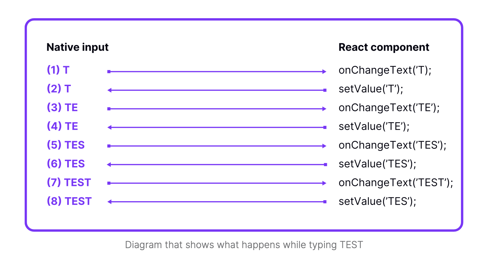

# Skill: Uncontrolled 컴포넌트

Uncontrolled 컴포넌트 패턴을 사용하여 TextInput 동기화 및 깜빡임 문제를 해결합니다.

## 빠른 패턴

**Before (controlled - legacy arch에서 깜빡일 수 있음):**

```jsx
<TextInput value={text} onChangeText={setText} />
```

**After (uncontrolled - 네이티브가 상태 소유):**

```jsx
<TextInput defaultValue={text} onChangeText={setText} />
```

## 언제 사용하나요

- TextInput이 빠른 타이핑 중 깜빡이거나 잘못된 문자를 표시
- 저사양 기기에서 텍스트 입력이 사용자 입력보다 느림
- 레거시(New Architecture 아닌) React Native 사용 중
- 최대 입력 반응성 필요

## 사전 준비사항

- React controlled vs uncontrolled 컴포넌트 이해
- TextInput 컴포넌트 사용 중

## 문제 설명



다이어그램은 controlled `TextInput`으로 "TEST"를 입력할 때 일어나는 일을 보여줍니다:

1. 사용자가 "T" 입력 → `onChangeText('T')` 발생
2. React가 `setValue('T')` 호출 → 네이티브가 "T"로 업데이트
3. 사용자가 "E" 입력 → `onChangeText('TE')` 발생
4. React가 `setValue('TE')` 호출 → 네이티브가 "TE"로 업데이트
5. ...각 문자마다 계속됨

**문제**: 각 문자는 네이티브와 JavaScript 간 왕복이 필요합니다. 레거시 아키텍처에서 React state 업데이트가 느리면 네이티브가 중간 상태를 표시할 수 있습니다(깜빡임).

**New Architecture 참고:** 이 문제는 New Architecture에서 대부분 해결되었지만, uncontrolled 패턴은 여전히 최고의 성능을 제공합니다.

## 단계별 가이드

### 1. Controlled TextInput 식별

```jsx
// Controlled - value prop이 state를 네이티브와 동기화
const ControlledInput = () => {
  const [value, setValue] = useState('');

  return (
    <TextInput
      value={value}           // 동기화 문제 발생
      onChangeText={setValue}
    />
  );
};
```

### 2. Uncontrolled로 변환

`value` prop을 제거하여 uncontrolled로 만들기:

```jsx
// Uncontrolled - 네이티브가 상태 소유
const UncontrolledInput = () => {
  const [value, setValue] = useState('');

  return (
    <TextInput
      defaultValue={value}     // 초기값만 설정
      onChangeText={setValue}  // 여전히 React state 업데이트
    />
  );
};
```

### 3. 프로그래매틱 제어를 위해 Ref 사용

값을 프로그래매틱하게 읽기/설정해야 하는 경우:

```jsx
const UncontrolledWithRef = () => {
  const inputRef = useRef(null);

  const clearInput = () => {
    inputRef.current?.clear();
  };

  const getValue = () => {
    // onChangeText로 값 추적, 또는 네이티브 메서드 사용
  };

  return (
    <TextInput
      ref={inputRef}
      defaultValue=""
      onChangeText={(text) => console.log('Current:', text)}
    />
  );
};
```

## 코드 예제

### 전체 마이그레이션 예제

**Before (Controlled):**

```jsx
const SearchInput = () => {
  const [query, setQuery] = useState('');
  const [results, setResults] = useState([]);

  const handleChange = (text) => {
    setQuery(text);
    fetchResults(text).then(setResults);
  };

  return (
    <View>
      <TextInput
        value={query}              // 이것을 제거
        onChangeText={handleChange}
        placeholder="Search..."
      />
      <ResultsList data={results} />
    </View>
  );
};
```

**After (Uncontrolled):**

```jsx
const SearchInput = () => {
  const [query, setQuery] = useState('');
  const [results, setResults] = useState([]);

  const handleChange = (text) => {
    setQuery(text);
    fetchResults(text).then(setResults);
  };

  return (
    <View>
      <TextInput
        defaultValue=""           // 초기값만
        onChangeText={handleChange}
        placeholder="Search..."
      />
      <ResultsList data={results} />
    </View>
  );
};
```

### 값 제어가 필요한 경우

입력 마스킹이나 값을 수정하는 유효성 검사의 경우:

```jsx
// 옵션 1: controlled 동작 수용 (깜빡일 수 있음)
const MaskedInput = () => {
  const [value, setValue] = useState('');

  const handleChange = (text) => {
    // 전화번호 마스크: (123) 456-7890
    const masked = maskPhone(text);
    setValue(masked);
  };

  return (
    <TextInput
      value={value}  // 마스킹에 필요
      onChangeText={handleChange}
    />
  );
};

// 옵션 2: 네이티브 마스킹 입력 라이브러리 사용
// react-native-masked-text가 네이티브에서 처리
```

## 결정 매트릭스

| 시나리오 | 권장사항 |
|----------|---------------|
| 단순 텍스트 입력 | Uncontrolled |
| 검색/필터 입력 | Uncontrolled |
| 제출 시 유효성 검사가 있는 폼 | Uncontrolled |
| 입력 마스킹 (전화번호, 신용카드) | Controlled 또는 네이티브 라이브러리 |
| 문자별 유효성 검사 | Controlled |
| New Architecture 앱 | 둘 다 잘 작동 |

## 흔한 실수

- **`defaultValue` 잊기**: 없으면 입력이 빈 상태로 시작
- **state로 clear하려고 시도**: 대신 `ref.current.clear()` 사용
- **패턴 혼용**: `value`와 `defaultValue`를 함께 사용하지 마세요

## 관련 스킬

- [js-profile-react.md](./js-profile-react.md) - 입력 성능 프로파일링
- [js-concurrent-react.md](./js-concurrent-react.md) - 비싼 검색 작업 지연
