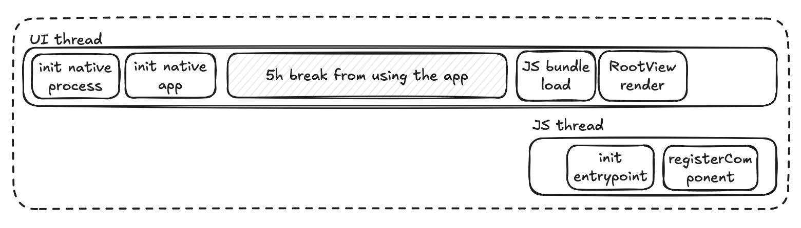

# Skill: TTI (Time to Interactive) 측정

성능 마커를 설정하여 앱 시작 시간을 측정하고 TTI 개선을 추적합니다.

## 빠른 명령어

```bash
npm install react-native-performance
```

```tsx
// 화면이 상호작용 가능해질 때 마킹
import performance from 'react-native-performance';

useEffect(() => {
  performance.mark('screenInteractive');
}, []);
```

## 언제 사용하나요

- 앱 시작이 느리게 느껴질 때
- 최적화를 위한 기준선 메트릭 필요
- 성능 모니터링 설정
- 릴리스 간 TTI 비교

## 사전 준비사항

- `react-native-performance` 라이브러리 (권장)

```bash
npm install react-native-performance
```

> **참고**: 이 스킬은 시각적 타임라인 다이어그램과 프로파일러 출력 해석이 필요합니다. AI 에이전트는 아직 스크린샷을 자동으로 처리할 수 없습니다. 메트릭을 직접 검토하면서 이 가이드를 참고하거나, MCP 기반 시각적 피드백 통합을 기다려주세요(로드맵 참고).

## TTI 이해하기

**Time to Interactive**: 앱 아이콘 탭부터 사용 가능한 콘텐츠 표시까지의 시간.

### 시작 유형

| 유형 | 설명 | 측정? |
|------|-------------|----------|
| Cold | 메모리에 앱 없음, 전체 초기화 | ✅ 예 |
| Warm | 프로세스 존재, 액티비티 재생성 | ❌ 건너뜀 |
| Hot | 백그라운드 앱, 재개됨 | ❌ 건너뜀 |
| Prewarmed (iOS) | iOS 사전 초기화된 앱 | ❌ 필터링 |

**일관된 메트릭을 위해 콜드 스타트만 측정**하세요.

## React Native 시작 파이프라인



다이어그램은 웜 스타트(앱이 메모리에 있었음)를 보여줍니다:

**UI 스레드:**
1. `init native process` → `init native app`
2. 사용자가 떠나 있는 동안의 간격 (예: "5h break from using the app")
3. `JS bundle load` → `RootView render`

**JS 스레드 (병렬 실행):**
- `init entrypoint` → `registerComponent`

**파이프라인 마커:**
```
1. Native Process Init     (nativeLaunchStart → nativeLaunchEnd)
2. Native App Init         (appCreationStart → appCreationEnd)
3. JS Bundle Load          (runJSBundleStart → runJSBundleEnd)
4. RN Root View Render     (contentAppeared)
5. React App Interactive   (screenInteractive) ← 이것이 TTI
```

## 단계별 구현

### 1. 콜드 스타트 감지

**iOS (Swift):**

```swift
let isColdStart = ProcessInfo.processInfo.environment["ActivePrewarm"] != "1"
```

**Android (Kotlin):**

```kotlin
class MainApplication : Application() {
    var isColdStart = false

    override fun onCreate() {
        super.onCreate()

        var firstPostEnqueued = true
        Handler().post { firstPostEnqueued = false }

        registerActivityLifecycleCallbacks(object : ActivityLifecycleCallbacks {
            override fun onActivityCreated(activity: Activity, savedInstanceState: Bundle?) {
                unregisterActivityLifecycleCallbacks(this)
                if (firstPostEnqueued && savedInstanceState == null) {
                    isColdStart = true
                }
            }
            // ... 다른 콜백들
        })
    }
}
```

### 2. 포그라운드 상태 확인

앱이 포그라운드에서 시작할 때만 측정합니다.

**iOS:**

```swift
var isForegroundProcess = false

override func application(_ application: UIApplication,
    didFinishLaunchingWithOptions launchOptions: [UIApplication.LaunchOptionsKey: Any]?) -> Bool {
    if application.applicationState == .active {
        isForegroundProcess = true
    }
    return true
}
```

**Android:**

```kotlin
private fun isForegroundProcess(): Boolean {
    val processInfo = ActivityManager.RunningAppProcessInfo()
    ActivityManager.getMyMemoryState(processInfo)
    return processInfo.importance == IMPORTANCE_FOREGROUND
}
```

### 3. 성능 마커 설정

`react-native-performance` 사용:

**Native (iOS):**

```swift
import ReactNativePerformance

RNPerformance.sharedInstance().mark("appCreationStart")
// ... 앱 초기화 ...
RNPerformance.sharedInstance().mark("appCreationEnd")
```

**Native (Android):**

```kotlin
import com.oblador.performance.RNPerformance

RNPerformance.getInstance().mark("appCreationStart")
// ... 앱 초기화 ...
RNPerformance.getInstance().mark("appCreationEnd")
```

### 4. 화면 상호작용 가능 마킹 (JavaScript)

```tsx
import performance from 'react-native-performance';

export default function HomeScreen() {
    useEffect(() => {
        // 의미 있는 콘텐츠가 표시될 때 마킹
        performance.mark('screenInteractive');
    }, []);

    return <TabNavigator />;
}
```

### 5. 메트릭 수집 및 리포트

```tsx
import performance from 'react-native-performance';

const collectTTIMetrics = () => {
    const entries = performance.getEntriesByType('mark');

    // 기간 계산
    const metrics = {
        nativeInit: getMarkDuration('nativeLaunchStart', 'nativeLaunchEnd'),
        appCreation: getMarkDuration('appCreationStart', 'appCreationEnd'),
        jsBundleLoad: getMarkDuration('runJSBundleStart', 'runJSBundleEnd'),
        tti: getMarkDuration('nativeLaunchStart', 'screenInteractive'),
    };

    // 분석으로 전송
    analytics.track('app_performance', metrics);
};
```

## 내장 마커

`react-native-performance`는 자동 마커를 제공합니다:

| 마커 | 설명 |
|--------|-------------|
| `nativeLaunchStart` | 프로세스 시작 (pre-main) |
| `nativeLaunchEnd` | 네이티브 초기화 완료 |
| `runJSBundleStart` | JS 번들 로딩 시작 |
| `runJSBundleEnd` | JS 번들 로드됨 |
| `contentAppeared` | RN 루트 뷰 렌더링됨 |

## 네이티브 이벤트 리스닝

**iOS (JS Bundle Load):**

```swift
NotificationCenter.default.addObserver(
    self,
    selector: #selector(onJSLoad),
    name: NSNotification.Name("RCTJavaScriptDidLoadNotification"),
    object: nil
)
```

**Android (JS Bundle Load):**

```kotlin
ReactMarker.addListener { name ->
    when (name) {
        RUN_JS_BUNDLE_START -> { /* 시작 마킹 */ }
        RUN_JS_BUNDLE_END -> { /* 종료 마킹 */ }
        CONTENT_APPEARED -> { /* 콘텐츠 마킹 */ }
    }
}
```

## 목표 메트릭

| 메트릭 | 좋음 | 허용 가능 | 개선 필요 |
|--------|------|------------|------------|
| TTI | < 2s | 2-4s | > 4s |
| JS Bundle Load | < 500ms | 500ms-1s | > 1s |
| Native Init | < 500ms | 500ms-1s | > 1s |

**참고**: 목표는 앱 복잡도와 기기 등급에 따라 다릅니다.

## 흔한 실수

- **Prewarmed 스타트 포함**: iOS prewarming이 메트릭을 왜곡
- **Warm/Hot 스타트 측정**: 콜드 스타트만 의미 있음
- **잘못된 screenInteractive 위치**: 마운트만 된 게 아니라 진정으로 상호작용 가능할 때 마킹
- **백그라운드 런치 필터링 안 함**: 푸시 알림이 백그라운드에서 앱을 시작할 수 있음

## 관련 스킬

- [bundle-analyze-js.md](./bundle-analyze-js.md) - JS 번들 로드 시간 줄이기
- [native-profiling.md](./native-profiling.md) - 네이티브 초기화 프로파일링
- [bundle-hermes-mmap.md](./bundle-hermes-mmap.md) - Android TTI 개선
