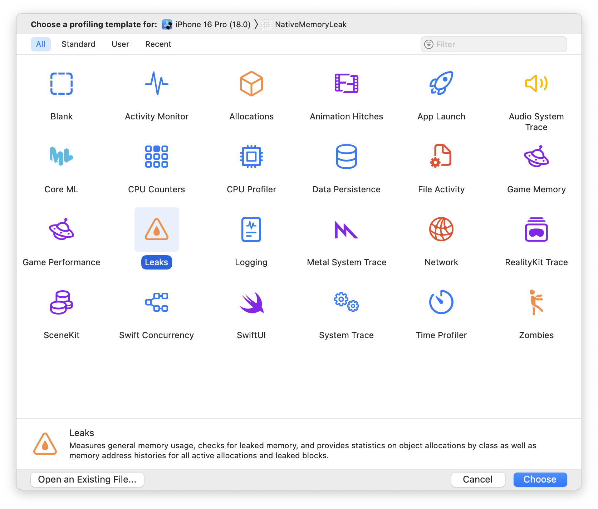

# Skill: 네이티브 메모리 누수 찾기

Xcode Leaks와 Android Studio Memory Profiler를 사용하여 네이티브 메모리 누수를 찾습니다.

## 빠른 명령어

```bash
# iOS: Leaks instrument로 프로파일링
# Xcode → Product → Profile (Cmd+I) → Leaks 템플릿

# Android: Memory Profiler
# Android Studio → Run → Profile → Track Memory Consumption
```

## 언제 사용하나요

- JS 프로파일러에서 누수가 없는데도 앱 메모리 증가
- 네이티브 모듈이 누수 의심
- 액티비티 재생성이 메모리 증가 유발 (Android)
- C++/Swift/Kotlin 코드 조사 중

## iOS: Xcode Leaks

### 빠른 체크: Memory Report

1. Xcode를 통해 앱 실행
2. **Debug Navigator** (사이드 패널) 열기
3. **Memory** 클릭
4. 지속적인 증가가 있는지 그래프 관찰

### 심층 분석: Instruments Leaks



1. **Xcode → Product → Profile** (또는 Cmd+I)
2. **Leaks** 템플릿 선택 (그리드에서 주황색 삼각형 아이콘으로 강조됨)
3. **Choose** 클릭
4. **Record** (빨간 원) 클릭
5. 앱 사용, 의심되는 동작 수행
6. 기록 중지

템플릿 피커는 사용 가능한 모든 Instruments를 보여줍니다:
- **Leaks**: 메모리 누수 감지 (우리가 필요한 것)
- **Allocations**: 시간에 따른 모든 메모리 할당
- **Time Profiler**: CPU 사용량 프로파일링
- **Zombies**: 할당 해제된 객체로의 메시지 감지

### 결과 분석

**빨간 마커** = 메모리 누수 감지됨

누수 클릭 시 표시:
- **Leaked Object**: 타입과 크기
- **Responsible Library**: 어떤 코드가 누수시켰는지
- **Responsible Frame**: 정확한 함수
- **Stack Trace**: 전체 호출 경로 (오른쪽 패널)

**함수 더블클릭**하면 소스 코드를 볼 수 있습니다.

### 일반적인 iOS 누수: delete 누락

```cpp
// 나쁨: 메모리 누수
void createNewStrings() {
    std::string* str = new std::string("Hello");
    // delete str; 잊음
}

// 좋음: 수정됨
void createNewStrings() {
    std::string* str = new std::string("Hello");
    // ... str 사용 ...
    delete str;
}

// 더 좋음: 스마트 포인터 사용
void createNewStrings() {
    auto str = std::make_unique<std::string>("Hello");
    // 자동으로 삭제됨
}
```

## Android: Memory Profiler

### 프로파일러 실행

1. **Run → Profile** (또는 툴바에서 Profile 클릭)
2. 또는: **View → Tool Windows → Profiler**
3. **"Track Memory Consumption"** 선택

### 기록

1. 앱 시작
2. 누수 가능성이 있는 동작 수행
3. 메모리 그래프에서 증가 패턴 관찰

### 할당 분석

Memory profiler 표시:
- **Allocations count**: 생성된 객체
- **Deallocations count**: 해제된 객체
- **Live objects**: 메모리에 여전히 존재

**allocations >> deallocations이면** 누수가 있는 것입니다.

### 일반적인 Android 누수: 리스너 미제거

```kotlin
// 나쁨: 설정 변경 시 MainActivity 누수
class MainActivity : AppCompatActivity(), Callback {
    override fun onCreate(savedInstanceState: Bundle?) {
        super.onCreate(savedInstanceState)
        EventManager.addListener(this)
        // 제거되지 않음!
    }
}

// 좋음: 리스너 제거
class MainActivity : AppCompatActivity(), Callback {
    override fun onCreate(savedInstanceState: Bundle?) {
        super.onCreate(savedInstanceState)
        EventManager.addListener(this)
    }

    override fun onDestroy() {
        EventManager.removeListener(this)
        super.onDestroy()
    }
}
```

### 액티비티 재생성 테스트

Android는 다음 경우 액티비티를 재생성합니다:
- 화면 회전
- 다크 모드 변경
- 로케일 변경

**테스트**: 기기를 여러 번 회전하여 이전 액티비티들이 해제되는지 확인하세요.

React Native 참고: RN은 매니페스트의 `android:configChanges`를 통해 옵트아웃하지만 네이티브 코드는 아닐 수 있습니다.

## 디버깅 워크플로우

### iOS

1. Instruments Leaks로 프로파일링
2. 의심되는 동작을 반복적으로 트리거
3. 빨간 누수 마커 대기
4. 클릭하여 responsible frame 식별
5. 수정 후 재테스트

### Android

1. 메모리 사용량 프로파일링
2. 의심되는 동작 트리거 (회전, 네비게이션)
3. allocation/deallocation 카운트 확인
4. deallocation이 0인 클래스 찾기
5. 수정 후 재테스트

## 패턴별 코드 수정

### 참조 순환 (Swift)

```swift
// 나쁨
class Parent {
    var child: Child?
}
class Child {
    var parent: Parent?  // 강한 참조 순환
}

// 좋음
class Parent {
    var child: Child?
}
class Child {
    weak var parent: Parent?  // weak으로 순환 끊기
}
```

### 정리 누락 (C++)

```cpp
// 나쁨
void process() {
    auto* data = new LargeData();
    if (error) return;  // 누수!
    delete data;
}

// 좋음: unique_ptr로 RAII
void process() {
    auto data = std::make_unique<LargeData>();
    if (error) return;  // 자동으로 정리됨
}
```

### 참조를 보유하는 전역 싱글톤 (Kotlin)

```kotlin
// 나쁨: 강한 참조 보유
object Cache {
    private val items = mutableMapOf<String, Callback>()
}

// 좋음: weak 참조 사용
object Cache {
    private val items = mutableMapOf<String, WeakReference<Callback>>()
}
```

## 검증

수정 후:
1. 프로파일러 재실행
2. 동일한 동작 수행
3. 확인:
   - iOS: 빨간 누수 마커 없음
   - Android: Allocations ≈ Deallocations

## 흔한 실수

- **디버그 모드에서 테스트**: 일부 누수는 릴리스에서만 나타남
- **GC 대기 안 함**: 누수가 없다고 결론짓기 전 GC 강제 실행
- **작은 누수 무시**: 시간이 지나면 쌓임
- **invalidate()에서 정리 누락**: Turbo Modules는 적절한 정리 필요

## 관련 스킬

- [native-memory-patterns.md](./native-memory-patterns.md) - 메모리 패턴 이해
- [js-memory-leaks.md](./js-memory-leaks.md) - JS 측 누수
- [native-threading-model.md](./native-threading-model.md) - 모듈 무효화
