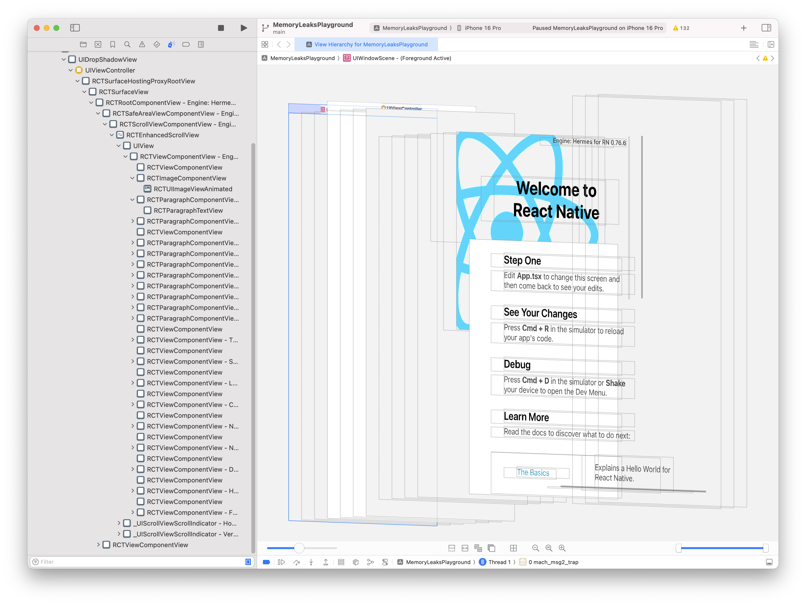

# Skill: View Flattening

React Native의 view flattening 최적화를 이해하고 디버깅합니다.

## 빠른 패턴

**문제 (자식이 예상치 않게 flattening됨):**

```jsx
<NativeTabBar>
  <Tab1 />  // Flatten될 수 있어 네이티브 컴포넌트 깨짐
  <Tab2 />
</NativeTabBar>
```

**해결책 (flattening 방지):**

```jsx
<NativeTabBar>
  <Tab1 collapsable={false} />
  <Tab2 collapsable={false} />
</NativeTabBar>
```

## 언제 사용하나요

- 네이티브 컴포넌트가 예상치 않은 자식 수 받음
- 네이티브 컴포넌트로 레이아웃 디버깅
- 자식을 받는 네이티브 컴포넌트 빌드
- React Native 렌더링 이해

> **참고**: 이 스킬은 시각적 view hierarchy 도구(Xcode Debug View Hierarchy, Android Layout Inspector) 해석이 필요합니다. AI 에이전트는 아직 스크린샷을 자동으로 처리할 수 없습니다. 계층구조를 직접 검토하면서 이 가이드를 참고하거나, MCP 기반 시각적 피드백 통합을 기다려주세요(로드맵 참고).

## View Flattening이란?

React Native의 렌더러는 다음과 같은 "layout-only" 뷰를 자동으로 제거합니다:
- 레이아웃에만 영향 (시각적 렌더링 없음)
- 네이티브 뷰 계층구조에 존재할 필요 없음

**이점**: 메모리 감소, 빠른 렌더링, 얕은 뷰 트리.

## 네이티브 컴포넌트의 문제

```tsx
// 3개의 자식 예상
<MyNativeComponent>
  <Child1 />
  <Child2 />
  <Child3 />
</MyNativeComponent>
```

`Child1`이 flatten되면 내부 뷰가 직접 자식이 됨:

```tsx
// 네이티브 측은 3개 대신 5개 뷰 받음!
<MyNativeComponent>
  <View />   // Child1 내부에 있었음
  <View />   // Child1 내부에 있었음
  <View />   // Child1 내부에 있었음
  <Child2 />
  <Child3 />
</MyNativeComponent>
```

## `collapsable`로 Flattening 방지

```tsx
<MyNativeComponent>
  <Child1 collapsable={false} />
  <Child2 collapsable={false} />
  <Child3 collapsable={false} />
</MyNativeComponent>
```

이제 네이티브 측은 항상 정확히 3개 자식을 받습니다.

## View Hierarchy 디버깅



네이티브 디버깅 도구를 사용하여 실제 뷰 계층구조 확인:

### Xcode (iOS)

1. Xcode를 통해 앱 실행
2. 디버그 툴바에서 **"Debug View Hierarchy"** 클릭 (이미지에 표시)
3. 네이티브 계층구조의 3D 뷰 검사

**React Native 컴포넌트는 다음으로 매핑됨:**
- `<View />` → `RCTViewComponentView`
- `<Text />` → `RCTTextView`

### Android Studio

1. Android Studio를 통해 앱 실행
2. **View → Tool Windows → Layout Inspector**
3. 실행 중인 프로세스 선택

**React Native 컴포넌트는 다음으로 매핑됨:**
- `<View />` → `ReactViewGroup`
- `<Text />` → `ReactTextView`

## 코드 예제

### Flattening이 컴포넌트를 깨뜨릴 때

```tsx
// 네이티브 컴포넌트가 정확히 2개 탭 예상
const NativeTabBar = requireNativeComponent('RCTTabBar');

// 나쁨: TabContent가 flatten될 수 있음
const MyTabs = () => (
  <NativeTabBar>
    <TabContent title="Home">
      <View><Text>Home content</Text></View>
    </TabContent>
    <TabContent title="Profile">
      <View><Text>Profile content</Text></View>
    </TabContent>
  </NativeTabBar>
);

// 좋음: Flattening 방지
const MyTabs = () => (
  <NativeTabBar>
    <TabContent title="Home" collapsable={false}>
      <View><Text>Home content</Text></View>
    </TabContent>
    <TabContent title="Profile" collapsable={false}>
      <View><Text>Profile content</Text></View>
    </TabContent>
  </NativeTabBar>
);
```

### collapsable이 있는 Wrapper 컴포넌트

```tsx
// Flattening을 방지하는 Wrapper
const NativeChildWrapper = ({ children, ...props }) => (
  <View collapsable={false} {...props}>
    {children}
  </View>
);

// 사용법
<NativeComponent>
  <NativeChildWrapper>
    <ComplexChild />
  </NativeChildWrapper>
</NativeComponent>
```

## 뷰가 Flatten되는 경우

뷰는 다음과 같을 때 "layout-only"로 간주됨:
- `backgroundColor` 없음
- `borderWidth`, `borderColor` 없음
- `shadowColor`, `elevation` 없음
- 이벤트 처리 안 함 (`onPress` 등 없음)
- `opacity` < 1 사용 안 함
- `overflow: 'hidden'` 없음

## 뷰를 강제로 유지

`collapsable={false}` 외에 다음도 flattening 방지:

```tsx
// 이 중 어느 것이라도 flattening 방지
<View style={{ backgroundColor: 'transparent' }} />
<View style={{ borderWidth: 0.01 }} />
<View style={{ opacity: 0.99 }} />
<View onLayout={() => {}} />
```

하지만 `collapsable={false}`가 가장 깔끔한 해결책입니다.

## 디버깅 체크리스트

1. **네이티브 자식 수 확인**: 네이티브 코드에서 받은 자식 로깅
2. **Layout Inspector 사용**: 시각적 계층구조 디버깅
3. **collapsable={false} 추가**: Flattening이 문제인지 테스트
4. **Wrapper 컴포넌트 확인**: 중간 뷰가 flatten될 수 있음

## 흔한 실수

- **JS 자식 = 네이티브 자식 가정**: Flattening이 이를 변경
- **네이티브 컴포넌트 요구사항 문서화 안 함**: 네이티브 컴포넌트가 특정 자식 수 예상하면 문서화
- **collapsable={false} 과도 사용**: 필요할 때만 사용 (최적화 이점 손실)

## 관련 스킬

- [native-platform-setup.md](./native-platform-setup.md) - 디버깅을 위한 IDE 설정
- [native-profiling.md](./native-profiling.md) - 성능 영향 분석
